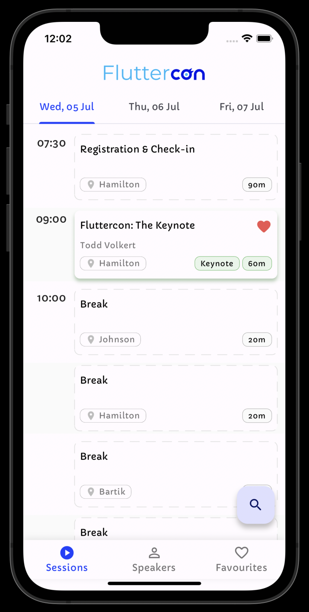
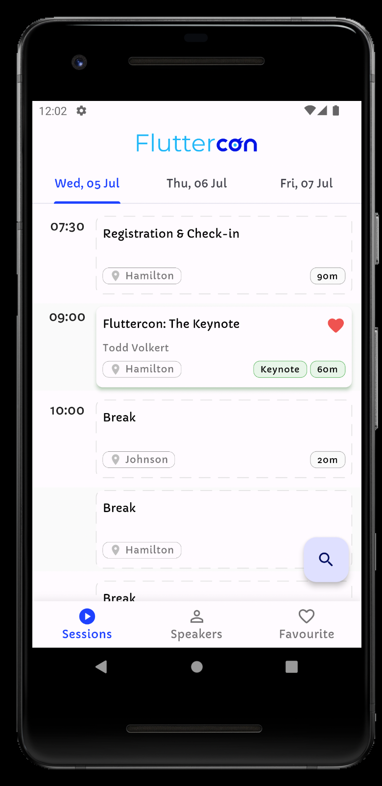
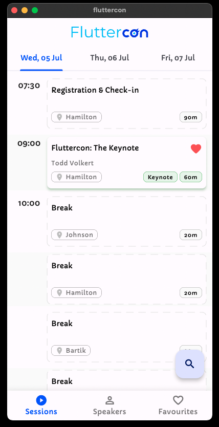
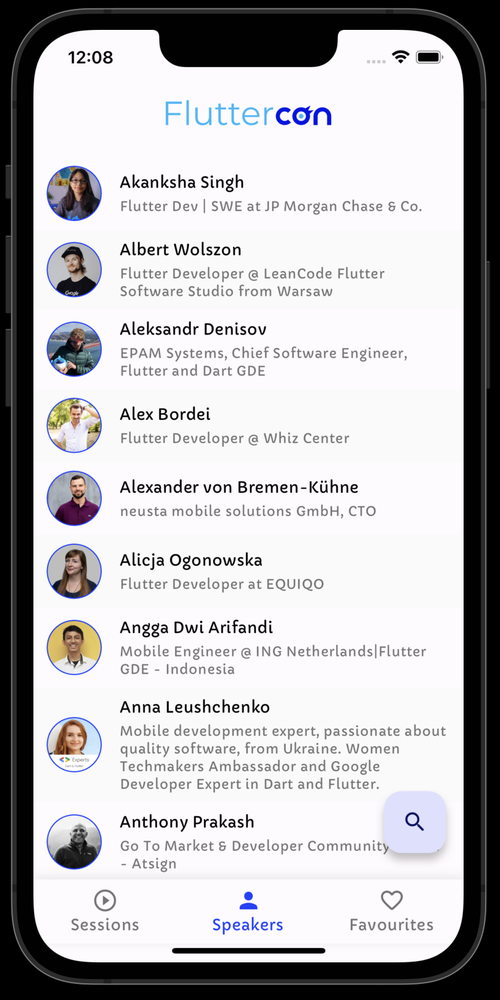
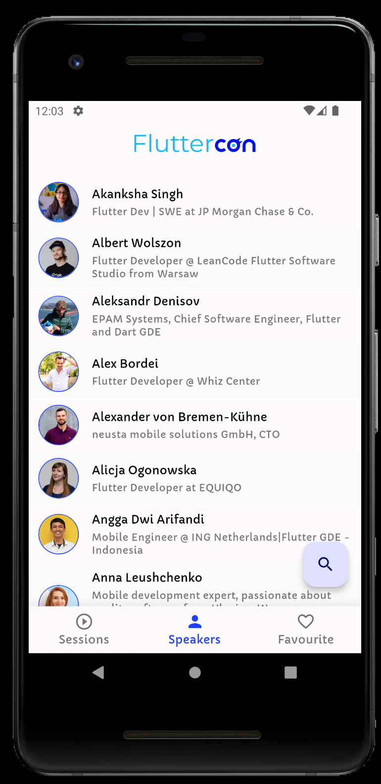
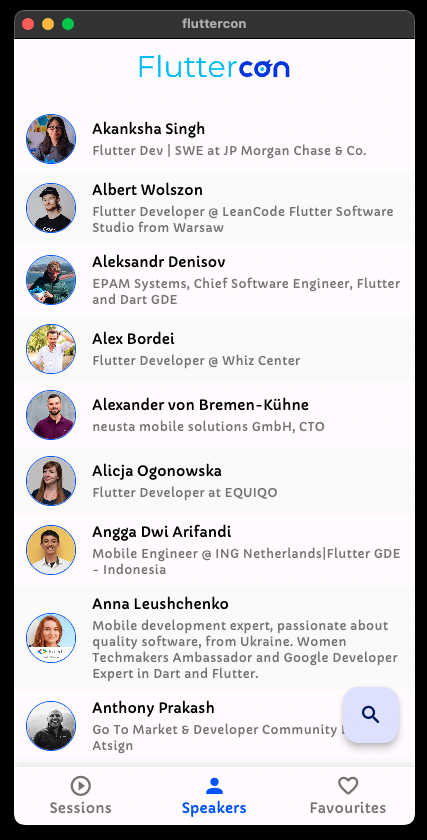
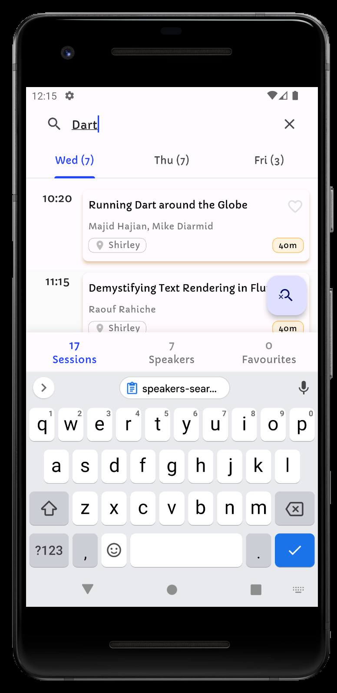
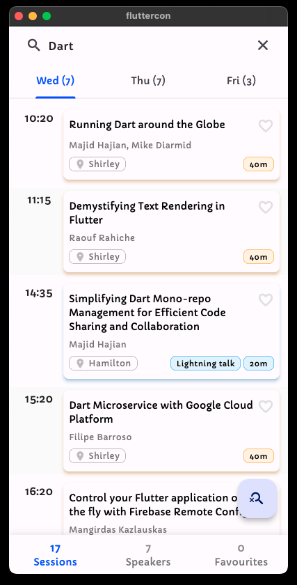
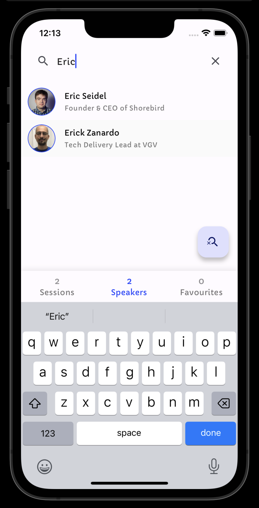
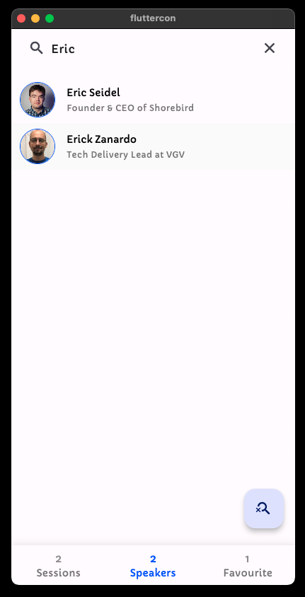

# fluttercon

iOS, Android and macOS app for [Fluttercon Berlin 2023](https://fluttercon.dev), built with Flutter.

### Download Links

| iOS | Android | macOS |
|:--:|:--:|:--:|
|||Not published|

### Screenshots

|                 | iOS                                                         | Android                                                             | macOS                                                           |
|-----------------|-------------------------------------------------------------|---------------------------------------------------------------------|-----------------------------------------------------------------|
| Sessions        |                |                |                |
| Speakers        |                |                |                |
| Sessions Search |  |  |  |
| Speakers Search |  |  |  |

### Dev Notes

- The project uses a line length of 120 characters
- The code can ideally be re-used for any conference that uses the Sessionize API
- The base url for the Sessionize API for Fluttercon has been gitignored. To run the app and see conference data, switch
  to the [not-for-prod/mock-api-response](https://github.com/rohan20/fluttercon/tree/not-for-prod/mock-api-response)
  branch that uses hardcoded Fluttercon 2023 responses instead.
- When running the app, make sure you set the flavor for the build to `production`
- ApiClient requires a baseUrl and so if you are running the app on the `not-for-prod/mock-api-response` branch, this can be set to `http://localhost`
